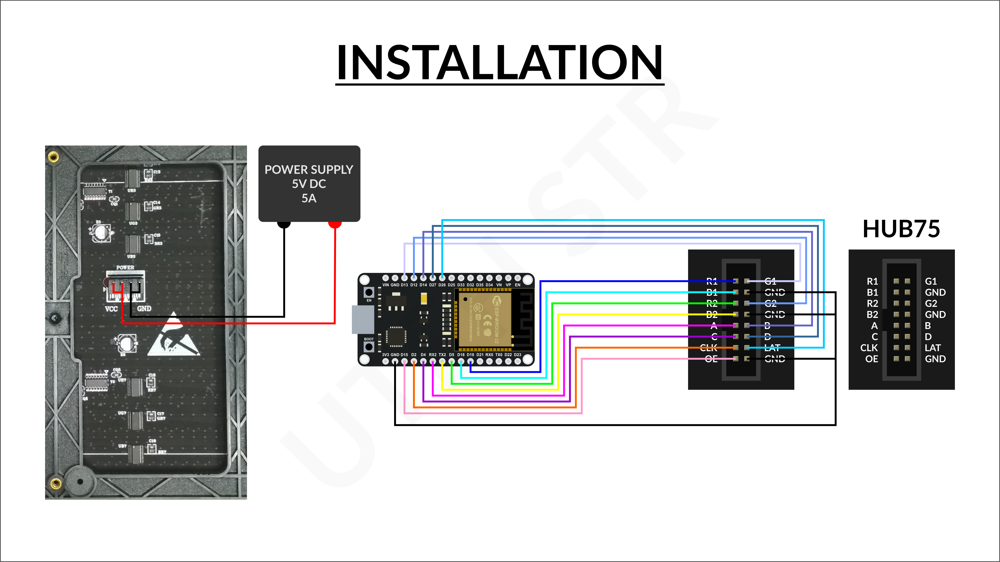
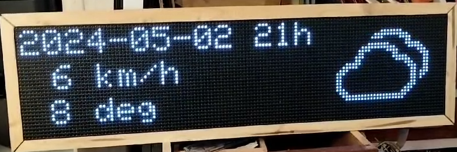
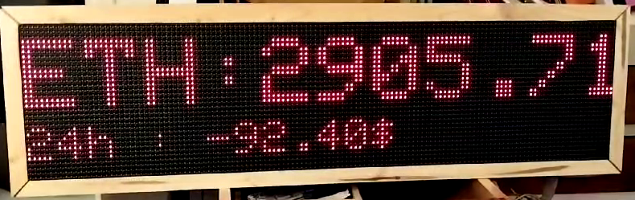
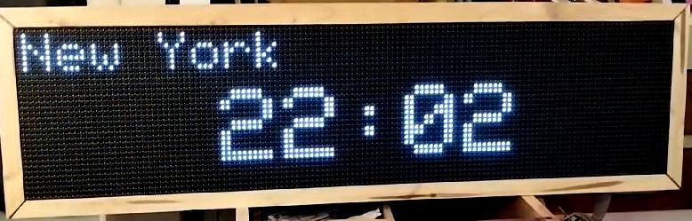
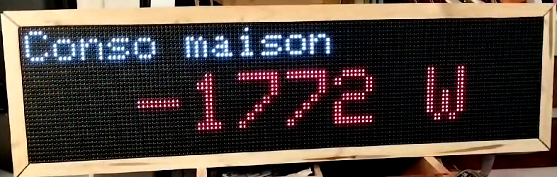

# ESP32 LED PANEL

Panneaux d'affichage connecté parmettant la récupération et l'affichage déroulant de données custom comme par exemple :

- cours de cryptomonnaies (API <livecoinwatch.com>)

- heure sur differents fuseaux

- production panneaux solaire et consommation électrique de la maison (API <www.solaxcloud.com> dans mon cas

- couleur EDF Tempo (API <particulier.edf.fr>)

- Prévision météo (API <openweathermap.org>)

Il va falloir 

 - un ESP32 pour se connecter au réseau et récupérer les infos
<https://fr.aliexpress.com/item/1005006422498371.html>

 - des panneaux led P5
<https://fr.aliexpress.com/item/32760855293.html>
 
pour le cablage :

Voil1 ce que ca peut donner, a vous de modifier !

